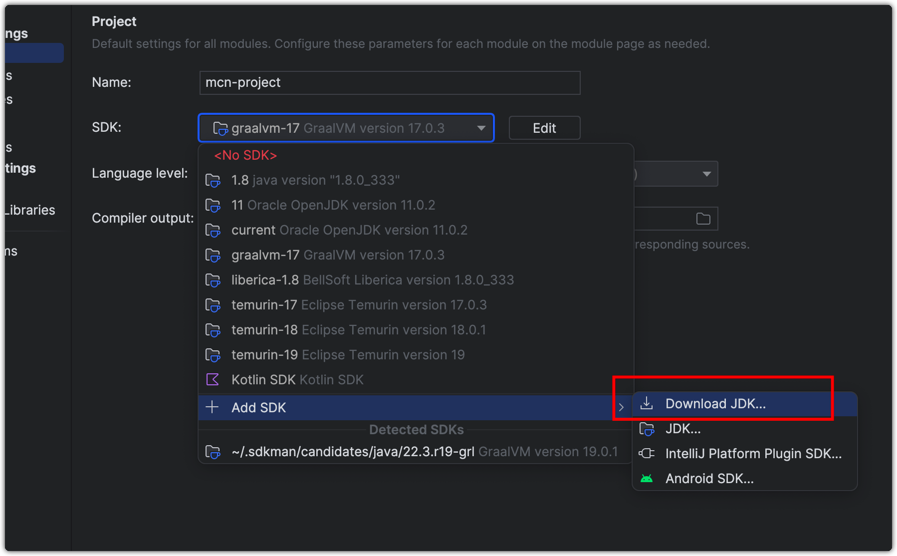
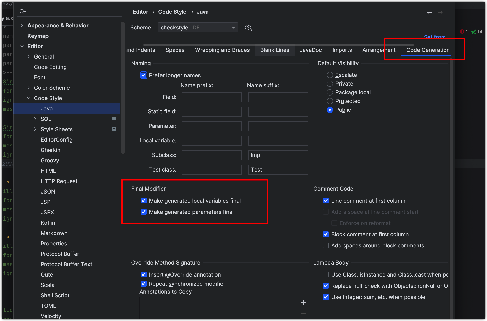
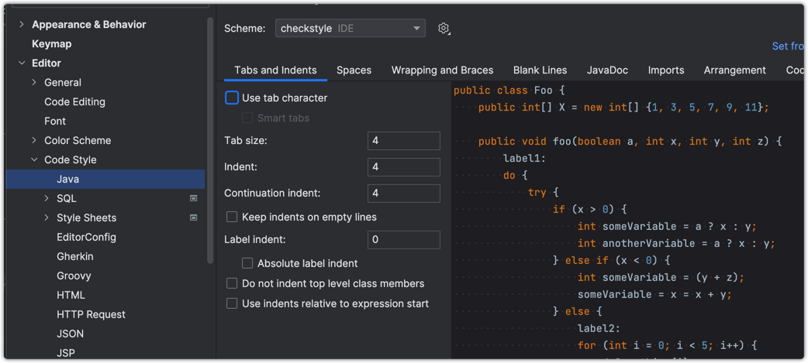
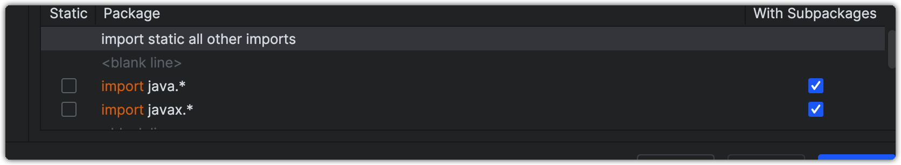
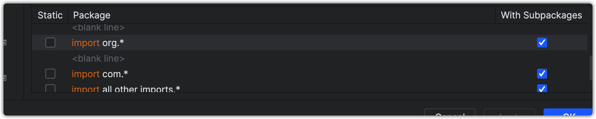
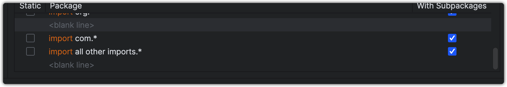
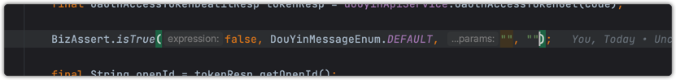

# JARK

## 模块介绍


## 配置

使用本项目需要配置以下内容，否则将可能会出现项目无法提交/运行

### JDK配置

**项目基于 SpringBoot3.0 开发，需要使用JDK17**

使用的JDK为 Eclipse Temurin JDK 17 这个版本



### final变量

本项目所有变量默认都需要配置为 final 类型


### 注入方式

本项目使用构造器注入并使用懒加载提高项目启动速度，禁止使用其他注入方式

```java
@RequiredArgsConstructor(onConstructor = @__(@Lazy))
```

### 缩进

项目使用 tab 键 4个空格


### CheckStyle配置

**项目使用 CheckStyle 进行风格检查，如果检查不通过将无法提交代码**

#### 配置IDEA代码风格

修改导入合并和自动导包顺序


```text
import static all other imports
<blank line>
import java.*
import javax.*
<blank line>
import org.*
<blank line>
import com.*
import all other imports.*
<blank line>
```

配置好以后的顺序为:




### 断言

本项目使用 BizAssert 进行断言
使用方法:

> 第一个参数为表达式，需要处理的方法  
> 第二个参数为枚举类，其中包含 返回给前端的提示语句以及返回的状态码  
> 后面的参数为需要放入到提示语句中的变量（一般不使用）

### Git 代码提交风格 message

Git代码提交Commit规范

https://juejin.cn/post/6877462747631026190

https://www.conventionalcommits.org/zh-hans/v1.0.0/#%e7%ba%a6%e5%ae%9a%e5%bc%8f%e6%8f%90%e4%ba%a4%e8%a7%84%e8%8c%83